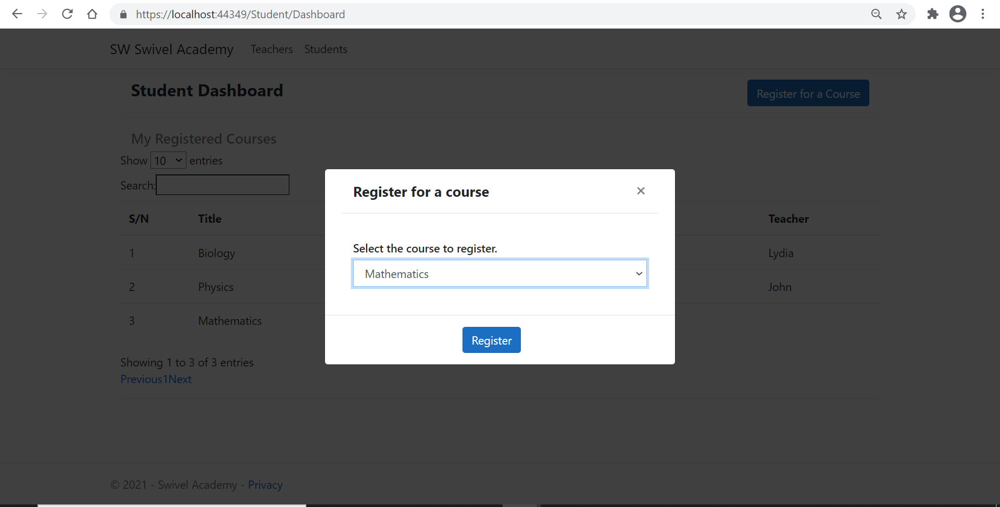

# Swivel Academy Solution

This solution contains Four projects namely

1. **Swivel Academy WEB**
2. **Swivel Academy API**
3.  **Swivel Academy Database**
4.  **Swivel Academy Test**

To create the database on your local machine, after cloning the project, kindly run **SQL Server Management Studio (SSMS)**, open 
a query window after connecting to a server and run this [script](./SwivelAcademyDB.sql)

Here is an image of the database diagram 

For, the API, I attached a screenshot here 

Here is a shared screen from the project web 

Screen where student select course to register for

Student views all their registered courses (up to 3)

Teacher can take up to 3 courses

Thank you.
